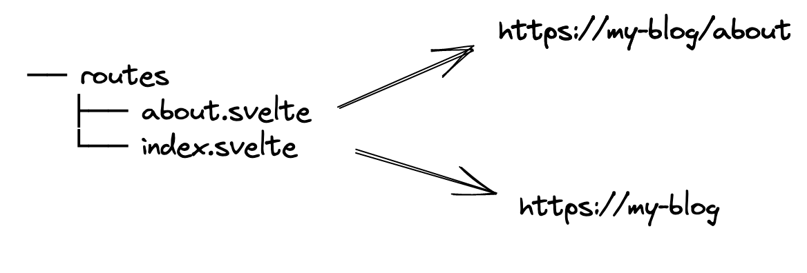
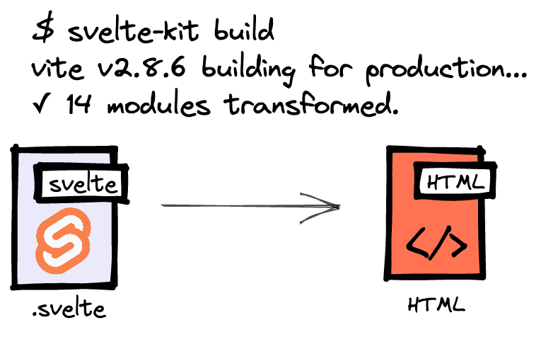
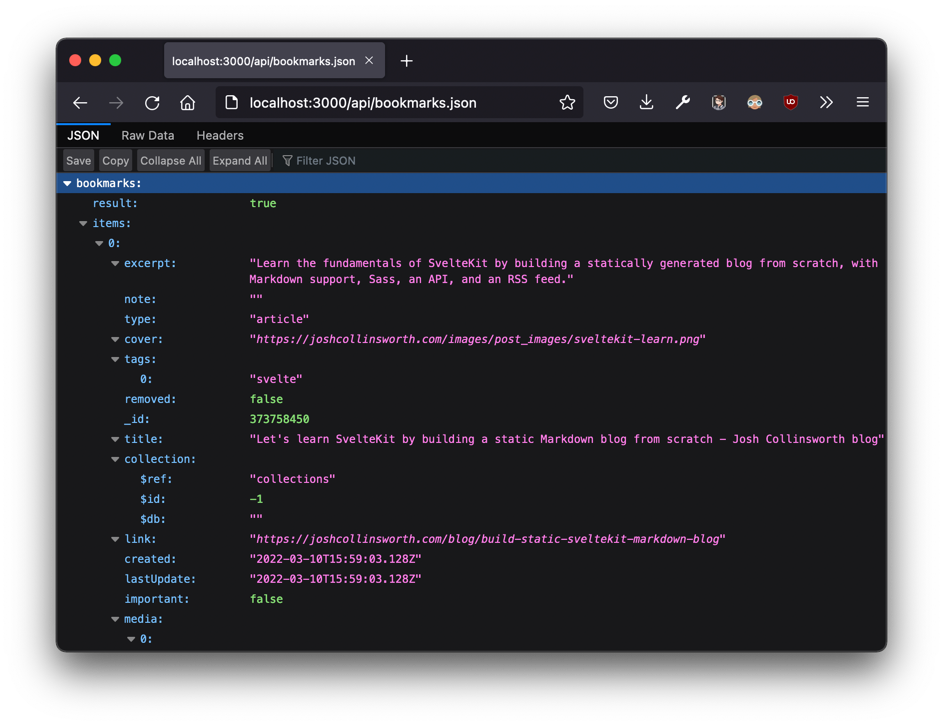
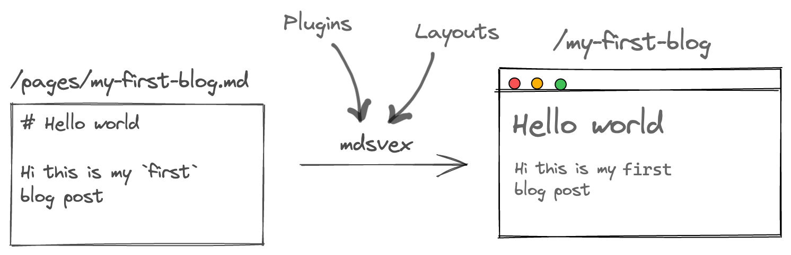

import { Callout } from 'nextra/components'

<Callout emoji="👾">
  Bu yazi suan goruntulediginiz web sitesinin eski versiyonu icin yazilmistir. Sıkıldığım için Next.js tabanli [Nextra](https://nextra.site/) ile tekrar olusturdum 🤷‍♂️
</Callout>

Uzun zamandır aklımda kolayca içerik üretebileceğim, hızlı,
sade bir blog yapmak vardı. Pek çok farklı şekilde iyi-kötü(çoğunlukla kötü)
kendim için blog sayfaları oluşturmuştum. Backendini kendim yazdığım da oldu,
sadece frontendini yazıp backendini [Strapi](https://strapi.io/)'ye verdiğim de. Ama hep
bir şeyler istediğim gibi olmuyordu. Bir türlü ihtiyaçlarımı tam anlamıyla
karşılayacak bir web sitesi yapamamıştım kendime. Ama son 1 haftadır
Svelte ve SvelteKit ile istediğim siteyi oluşturduğumu düşünüyorum.
Bu yazıda bu web sitesini _Svelte_ ve _SvelteKit_ ile nasıl oluşturduğumu
anlatacağım

## İhtiyaçlarım

Websitesini yapmaya girişmeden önce ihtiyaçlarımı belirlemeye karar verdim.
Bunlar:

- Olabildiğince sade bir tasarım.

Websitemin daha çok içeriğe odaklı olması
gerektiğini düşündüğüm için, içeriği ön plana alacak şeklide bir
tasarım düşündüm. [Bu](https://antfu.me/),
[bu](https://www.aleksandrhovhannisyan.com/) ve
[bu](https://ademilter.com/) sitelerden ilham aldığım söylenebilir.

- Hız.

Yaptığım şey altı üstü blog post paylaşmak. Bu dönemde böyle bir iş
çok fazla kaynak tüketmese gerek. Dolayısıyla sitenin ve sayfaların açılış
hızı olabilidiğince hızlı olmalı.

- Hızlıca içerik üretebilme.

Önceki denediğim sistemlerde, bir şeyler paylaşmak
hiç kolay değildi. Kolaycadan kastım şu: Aklıma gelen veya paylaşmak
istediğim bir şeyi telefonda olsam bile yazıp tek tuşla yayına almak.

- Bol özellikli makale yazma formatı.

Bir yazılım geliştirici olduğum için aşına olduğum metin yazma formatı
`markdown`. Ama sadece bu da yetmiyor, yeri geliyor makalede interaktif
bir şeyler yapabilmek istiyorum. Ayırca kod formatlama, syntax highlighting
de gelişmiş olmalı.

## Neler kullandım

- [Svelte](https://svelte.dev/) - _Kullandığım frontend framework_
- [SvelteKit](https://kit.svelte.dev/) - _Svelte ile birlikte çalışan, server-side-rendering (SSR),
  static-site-generator (SSG) için framework_
- [Tailwind](https://tailwindcss.com/) - _CSS framework_
- [MDsveX](https://mdsvex.pngwn.io/) - _Markdown ve SvelteKit ile birlikte çalışan, markdown dosyalarını
  process eden kütüphane_
- [Notion.so](https://www.notion.so) - _[snippets](/snippets) bölümü için kullandığım platform_
- [Upstash](https://upstash.com/) - Sayfaların ne kadar görüntülenme aldığını tutmak için `key-value`
  database
- [Raindrop.io](https://raindrop.io/) - _[bookmarks](/bookmarks) bölümü için kullandığım platform_

## SvelteKit ve SSG(Static Site Generator) nasıl çalışıyor?

Bir SvelteKit uygulaması oluşturduğunuzda, `/routes` adlı bir dizinle
gelir. Bu dizin içindeki dosyalara göre web sitenizin yolları belirlenir.



Bu sayfalar ayrıca static olarak `.html` dosyalarına dönüştürülebilir. Eğer
`svete.config.js` dosyasında `kit.prerender.default = true` yaparsanız,
varsayılan olarak `/routes` içindeki dosyaları statik olarak çalışmasını
sağlarsınız. `build` komutunu çalıştırmanız yeterli olur.



Eger backend'e işiniz düştüyse bunu bir endpoint yardımıyla çözebilirsiniz.

### Endpoints

SvelteKit uygulamalarınızda kendinize özel api uçları tasarlayabilirsiniz.
Bu uçlarda çalışacak kodlar backend içinde çalışır. Ben tamamen static
bir site yapmak istediğim için bu uçları, build alınırken çalıştırıp
sonuçlarını static olarak dosyalara yazacağım... Yani SvelteKit yazacak.

Bir endpoint içine temel HTTP methodları için ayrı ayrı fonksiyonlar
yazılabilir. Bunlar:

```js
export function get(event) {...}  // GET
export function post(event) {...}  // POST
export function put(event) {...}   // PUT
export function patch(event) {...} // PATCH
export function del(event) {...}   // DELETE
```

Benim işime şuan `GET` methodu yaradığı için `get` fonskiyonunu yazacağım
sadece.

```ts:/routes/api/bookmarks.json.ts
import type { RequestHandler } from '@sveltejs/kit';
import variables from '$lib/variables';

const RAINDROP_URL = 'https://api.raindrop.io/rest/v1/raindrops/0?perpage=30';

export const get: RequestHandler = async () => {
	const bookmarks = await (
		await fetch(RAINDROP_URL, {
			headers: {
				Authorization: `Bearer ${variables.RAINDROP_API_KEY}`
			}
		})
	).json();

	return {
		body: {
			bookmarks
		}
	};
};
```

Burada [Raindrop](https://raindrop.io/) ile kişisel bookmarklarımı çekiyoum. Ardından
aldığım değeri olduğu gibi endointden dönüyorum.

Sonrasında tarayıcımda `/api/bookmarks.json`'a gidersem dönen değeri
görebilirim.



Burada dikkat etmem gereken bu endpointin build zamanda çalışması için
dosya ismin `*.json.{js,ts}` şeklinde yazmış olmam. Sveltekit bu formatı
anlayıp build esnasında bu dosyayı çalıştırıyor ve sonuçlarını
`bookmarks.json` olarak bir dosyaya yazıyor.

Şimdi bunu sayfa componentimin içinde nasıl göstereceğim?

Svelte bunun için bana güzel bir API sunmuş.
Componentin server tarafında çalışmasını
istediğim kodlarını `<script context="module" />` tagları
arasına yazarsam, yazdığımız endpoint ile haberleşebilirim.

```svelte:/routes/bookmarks.svelte
<script context="module" lang="ts">
	import type { Load } from '@sveltejs/kit';

    // `load` özel bir fonksiyon. Bu sayfa açılmak istendiğinde
    // SvelteKit bu fonksiyonu çalıştıracak
    // dönen değeri aşağıdaki componente `props` olarak
    // gönderecek
	export const load: Load = async function ({ fetch }) {
		const { bookmarks } = await (await fetch('/api/bookmarks.json')).json();

		return {
			props: {
				bookmarks // aşağıya props olarak gönderiyorum
			}
		};
	};
</script>

<script>
  export let bookmarks; // Artık backend'den gelen değerim fronend'de
</script>

<h1 class="mb-2">Bookmarks</h1>
<hr class="my-6" />

{#each bookmarks.items as bookmark}
  <div class="my-9">
    <h1>{bookmark.title}</h1>
  </div>
{/each}
```

Bu sitedeki [`/bookmarks`](/bookmarks) yolundan bu kodların çıktısına
bakabilirsiniz.

Aynı şekilde [`/snippets`](/snippets) kısmını da bu yolla yaptım. Aynı
şeyleri yaptığım için anlatmaya gerek duymuyorum. [Notion.so](https://www.notion.so/)'dan gelen
verileri parse ettiğim sıkıcı kodlar var sadece :)
İsteyen [buradan](https://github.com/bufgix/website/blob/master/src/routes/api/snippets/index.json.ts) bakabilir

### Blog Postlar ve MDsveX

Peki, blog postlar için de `.svelte` dosyaları mı kullanıyorum?
Tabii ki hayır. Bunun için [MDsveX](https://mdsvex.pngwn.io/) markdown processor kullanıyorum.
Yaptığı şey basitçe `/routes` içinde bir `.md` dosyası varsa bunu parse
edip aynı bir svelte sayfası gibi göstermek. Bunu yaparken bol
eklenti desteği, metadata, layouts, syntax highlighting gibi pek çok
özelliğini de kullanbiliyorsunuz.



Kullandığım eklentiler ise şu şekilde:

```js
import relativeImages from 'mdsvex-relative-images';
import remarkHeadingId from 'remark-heading-id';
import figure from 'rehype-figure';
import codeTitle from 'remark-code-titles';

mdsvex({
  extensions: ['.md', '.svx'],
  remarkPlugins: [relativeImages, remarkHeadingId, codeTitle],
  rehypePlugins: [figure],
});
```

Bu websitesinin kodlarına açık kaynak olarak [Github](https://github.com/bufgix/website)'dan erişebilirsiniz.

### Kaynakça

- https://joshcollinsworth.com/blog/build-static-sveltekit-markdown-blog
- https://kit.svelte.dev/
