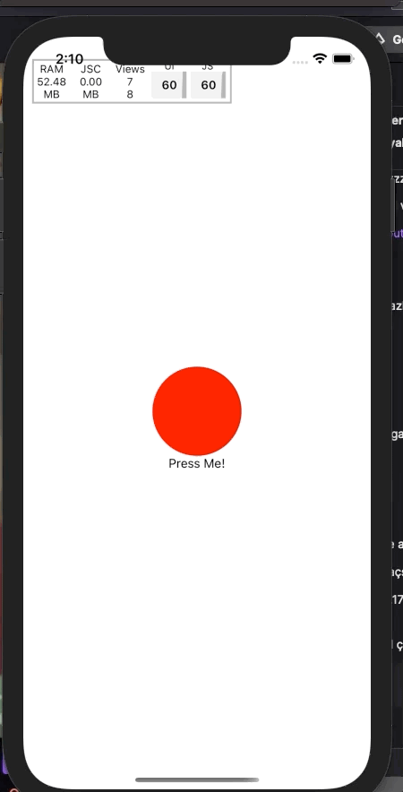
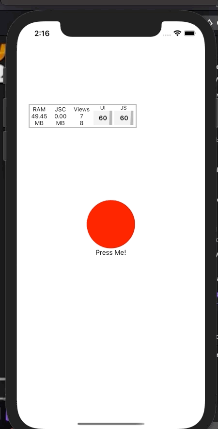
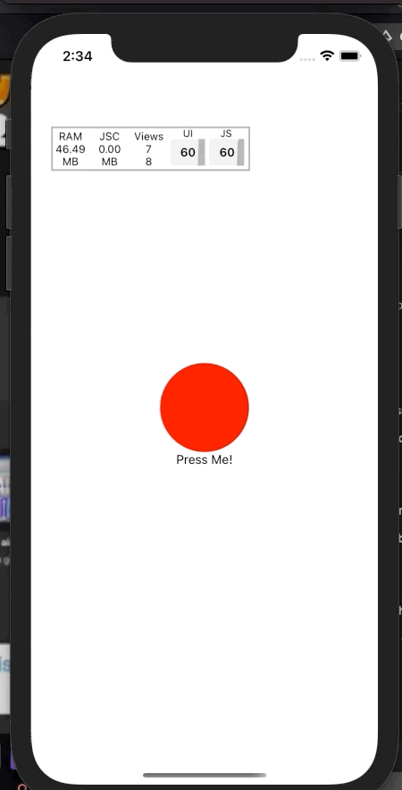

Eğer Raact Native'de animasyon işleriyle uğraştıysanız, animasyonu çalıştırırken `useNativeDriver` parametresini görmüşsünüzdür. Bu paramereyi ilk gördüğümde düşündüğüm şey, "Sanırım animasyon native kısımda çalışacak" oldu. Evet gerçekten de `useNativeDriver` animasyonu native tarafda çalıştırıyor. Peki bunu _nasıl_ yapıyor?

Her şeyden önce bir şeyi açıklığa kavuşturalım. React Native, bütün ekranları native olarak oluşturur yani animasyonların da native olarak oluşturulması gerekir. Javascript bir kutunun yerinin değiştirirken değişikliği haber vermek için bir şekilde işletim sistemi ile haberleşmesi gerekir. Javascript ile Native kod farklı threadlarda çalıştığı için (UI Thread) değişikliğin React Native'in sağladığı "**bridge**" ile işletim sistemine aktarılması gerekir.

### Animasyonları JS'ye vermek

Bir animasyon javascript tarafında kabaca şu adımları takip ederek oluşturulur.

- Animasyon başlar
- JS `requestAnimationFrame` fonksiyonunu çalıştırır. (Bu fonksiyon her saniye 60 kere çalıştırılmaya çalışılır.)
- JS değiştirilmek istenen şeyin bir sonraki konumunu/opaklığını/transformunu hesaplar
- JS hesapladığı değişikliği `bridge` aracılığıyla işletim sistemine gönderir.
- Köprünün diğer ucunda bulunan native kod, (Android için Java, IOS için Obj-C) belirtilen transform işlemini uygular.
- Ekranda yeni değişiklik güncellenir.

Burada dikkat etmeniz gereken nokta şudur; Animasyon devam ederken React _re-render_ işlemi yapmaz. Bunun sebebi `Animated API`' nin değeri _doğrudan_ native tarafa göndermesidir. Eğer öyle olmasaydı, animasyon değeri bir _React state'i_ gibi olsaydı, 60 saniyede bir component render olacaktı. Bu çok ciddi bir *performans kaybı *olurdu.

Her şey güzel JS animasyonlarımızı güzel güzel oluşturuyor. Fakat...

JS **tek thread**'da çalışır yani animasyonun bir sonraki değeri hesaplanırken aynı anda başka bir işlem **yapamayız**. Bu da JS tarafında oluşturulan animasyonun "gecikmeli(_laggy_)" olmasına sebep olur.

Bir örnek bu gecikmeyi daha iyi anlamanıza yardımcı olabilir.

```jsx
import React, { useRef } from "react";
import { SafeAreaView, Animated, TouchableOpacity, Text } from "react-native";

const App = () => {
  const scale = useRef(new Animated.Value(1)).current;

  const startAnimation = () => {
    Animated.timing(scale, {
      toValue: 2,
      duration: 600,
      useNativeDriver: false, // Native dirver devre dışı
    }).start();
  };

  return (
    <SafeAreaView
      style={{ flex: 1, justifyContent: "center", alignItems: "center" }}
    >
      <Animated.View
        style={{
          height: 100,
          width: 100,
          backgroundColor: "red",
          borderRadius: 9999,
          transform: [{ scale }],
        }}
      />
      <TouchableOpacity onPress={startAnimation}>
        <Text>Press Me</Text>
      </TouchableOpacity>
    </SafeAreaView>
  );
};

export default App;
```



Evet JS güzel bir şekilde animasyonu çalıştırıyor. Biraz daha zorlayalım

```js {7-13}
const startAnimation = () => {
  Animated.timing(scale, {
    toValue: 2,
    duration: 600,
    useNativeDriver: false,
  }).start();

  setTimeout(() => {
    let r = 0
    for(let i = 0; i < 1000000000; i++) {
      r = i ** i
    }
  }, 10)
```



Görüldüğü üzere JS threadinda FPS düştü ve animasyon* akıcılığını kaybetti.* Bunun nedeni daha önce dediğimiz gibi `scale` değerinin diğer kodlarla birlikte JS threadinda çalışması ve diğer kodları beklemesi.

Biraz daha açarsak, animasyon başladığı anda `requestAnimationFrame`saniyede 60 kere çalıştırılmaya çalışılacak. JS her defasında bir işlemi yapabileceği için

```js
setTimeout(() => {
  let r = 0;
  for (let i = 0; i < 1000000000; i++) {
    r = i ** i;
  }
}, 10);
```

bu kod JS threadi _meşgul_ edecek bir bir sonraki animasyon karesi atlanacak. Sonuç olarak "smooth" olmayan animsayonlar oluşacak.

Neyse ki React Native, native tarafta animasyonları oluşturmamıza izin verir.

### Animasyonları native tarafta çalıştırmak

Yukardaki problemi basitçe `useNativeDriver` parametresini `true` yaparak çözebilirsiniz

```js
Animated.timing(scale, {
  toValue: 2,
  duration: 600,
  useNativeDriver: true,
}).start();
```



Peki bu nasıl oluyor? Kabaca şöyle;

- Animasyon başlar
- JS animasyon için gerekli olan önbilgiyi "bridge" aracılığıyla aktarır
- **Native tarafta** animasyon oluşturulur.

Bu şekilde animasyon hesaplamalarını JS threadinden ayırdık. Böylelikle hem daha **hızlı animasyonlar** yaptık hem de React Native Bridge'i _darboğaz_ yapmamış olduk.

Bu noktada aklınıza şu gelebilir; "E o zaman `useNativeDriver`'i her zaman açalım"

Animasyonları native tarafta çalıştırmanın bazi **eksileri** vardır.

- Animasyonlar üstünde daha az yetkiye sahip olursunuz. (JS, animasyon devam ederken olan biteni gözlemleyemez.)
- Daha az özeliği manipüle edebilirsiniz. Mesela `height` veya `width` özeliklerini native olarak animate edemezsiniz.

### Sonuç olarak

Animasyonların React Native'de nasıl çalıştığını, hangi aşamalardan geçtiğini, `useNativeDriver`'in ne olduğunu, ne işe yaradığını göstermeye çalıştım. Umarım paylaştığım bilgiler yararlı olur.
