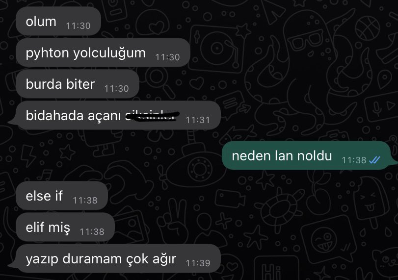

Twitterda gezinirken şöyle bir şey gördüm.

<blockquote class="twitter-tweet">
  <p lang="tr" dir="ltr">
    Python yüzünden dünya bi data engineer kaybetti
    <a href="https://t.co/t1W8392Nrz">pic.twitter.com/t1W8392Nrz</a>
  </p>
  &mdash; İlter (@koseilteer) <a href="https://twitter.com/koseilteer/status/1461979376199819266?ref_src=twsrc%5Etfw">
    November 20, 2021
  </a>
  
</blockquote>
<script
    async
    src="https://platform.twitter.com/widgets.js"
    charSet="utf-8"
    />

Insanların bir keyword yüzünden Pythonu bırakmasına gönlüm razı olmadı (!)
Bu yüzden bu `elif` keywordunu Python da `elseif` ile değişmeye karar verdim.

### Neden?

Makalenin amacı troll olsa da Python'u kaynak kodu üzerinden derleyip içeride ne döndüğüne bakmak, bu build
aşamalarının ne olduğunu görmek yapmak istediğim bir şeydi. Bir frontend dev olarak bu işler nasıl oluyor bakmak istedim.

### CPython'ı Derlemek

Şimdi şunu belirtmekte fayda var, terminalinize gelip `python` yazdığınızda çalışan şey %90 ihtimalle CPython. Peki ne bu CPython?
En kısa tanımı ile, Pythonun bir implementasyonu. Şöyle ki Python interpreteri de Python kodlarını çalıştıran bir program. CPython ise
bu programın C ile yazılmış versiyonu. Pek çok version yazılmış tabii ki ama en çok kullanılan bu version. CPythonun kaynak kodları
[burada](https://github.com/python/cpython) bulunuyor. Buradan kendinize bir fork çakıp o forku bilgisayarınıza klonlayın. Ben kendi adıma
klonlamıştım.

```bash
git clone https://github.com/bufgix/cpython
cd cpython
```

Mac bir cihaz kullandığım için yapmam gereken şu

```bash
brew install openssl xz gdbm
```

sonrasında `configure` scriptini çalıştıralım

```bash
./configure --with-pydebug --with-openssl=$(brew --prefix openssl)
```

daha sonra build almaya geçebiliriz.

```bash
make -s -j2
```

`-j2` flagı `make` in aynı anda 2 işi yapmabilmesini sağlar. Eğer 4 çekirdeğiniz varsa `-j4` diyebilirsiniz.
Bu noktadan itibaren bilgisayarınızın fan seslerini ve `tkinter` gibi paketlerinden çıkan hataları görmezden gelebilirsiniz.

İşlem bittiğinde tertemiz Python 3.11 binary si çıkmış olacak. Hemen test edelim

```bash
~/cpython on main
❯ ./python.exe
Python 3.11.0a2+ (heads/main-dirty:253b7a0a9f, Nov 26 2021, 15:26:42) [Clang 12.0.5 (clang-1205.0.22.11)] on darwin
Type "help", "copyright", "credits" or "license" for more information.
>>>
```

Nice!

### Dile keyword eklemek

Aslında yapacağımız şey dile yep yeni bir keyword eklemek değil. Var olan bir keywordün ismini değiştirmek. Dolayısıyla
işimiz çok daha kolay.

Python dilin syntaxını belirtmek için `Grammar/python.gram` dosyasını kullanıyor. Dil ile ilgili bir yazımı değiştirmek istediğimizde
bu dosyayı değiştirmek gerekiyor.

Dokümantasyona bakmadan ilk aklıma gelen IDE de `elif` keywordunu bulup bunu `elseif` değiştirmekti. 354. satırın oraları şöyle değiştirdim.

```gram {8-10}
if_stmt[stmt_ty]:
    | invalid_if_stmt
    | 'if' a=named_expression ':' b=block c=elif_stmt {
        _PyAST_If(a, b, CHECK(asdl_stmt_seq*, _PyPegen_singleton_seq(p, c)), EXTRA) }
    | 'if' a=named_expression ':' b=block c=[else_block] { _PyAST_If(a, b, c, EXTRA) }
elif_stmt[stmt_ty]:
    | invalid_elif_stmt
    | 'elif' a=named_expression ':' b=block c=elif_stmt {
        _PyAST_If(a, b, CHECK(asdl_stmt_seq*, _PyPegen_singleton_seq(p, c)), EXTRA) }
    | 'elif' a=named_expression ':' b=block c=[else_block] { _PyAST_If(a, b, c, EXTRA) }
else_block[asdl_stmt_seq*]:
    | invalid_else_stmt
    | 'else' &&':' b=block { b }

```

---

```gram {8-10}
if_stmt[stmt_ty]:
    | invalid_if_stmt
    | 'if' a=named_expression ':' b=block c=elif_stmt {
        _PyAST_If(a, b, CHECK(asdl_stmt_seq*, _PyPegen_singleton_seq(p, c)), EXTRA) }
    | 'if' a=named_expression ':' b=block c=[else_block] { _PyAST_If(a, b, c, EXTRA) }
elif_stmt[stmt_ty]:
    | invalid_elif_stmt
    | 'elseif' a=named_expression ':' b=block c=elif_stmt {
        _PyAST_If(a, b, CHECK(asdl_stmt_seq*, _PyPegen_singleton_seq(p, c)), EXTRA) }
    | 'elseif' a=named_expression ':' b=block c=[else_block] { _PyAST_If(a, b, c, EXTRA) }
else_block[asdl_stmt_seq*]:
    | invalid_else_stmt
    | 'else' &&':' b=block { b }

#  1220 li satırlara doğru ise
invalid_elif_stmt:
    | 'elseif' named_expression NEWLINE { RAISE_SYNTAX_ERROR("expected ':'") }
    | a='elseif' named_expression ':' NEWLINE !INDENT {
        RAISE_INDENTATION_ERROR("expected an indented block after 'elif' statement on line %d", a->lineno) }

```

Bu dosyayı her değiştiriğimzde `make regen-pegen` komutu ile `parser.c` dosyasının bu grammar file ile
yeniden generate edilmesini sağlamalıyız.

```bash
~/cpython on main
❯ make regen-pegen
PYTHONPATH=./Tools/peg_generator python3.9 -m pegen -q c \
		./Grammar/python.gram \
		./Grammar/Tokens \
		-o ./Parser/parser.new.c
python3.9 ./Tools/scripts/update_file.py ./Parser/parser.c ./Parser/parser.new.c

```

Güzel şimdi tekrar build alalım.

```bash
make -s -j8
```

Ve o da ne

```bash
~/cpython on main ⇡1 !2
❯ make -j8 -s
ld: warning: directory not found for option '-L/usr/local/opt/zlib/lib'
  File "<frozen importlib._bootstrap_external>", line 108
    elif new_root.endswith(':'):
    ^^^^
SyntaxError: invalid syntax
make: *** [Python/frozen_modules/importlib._bootstrap_external.h] Error 1
make: *** Waiting for unfinished jobs....
  File "<frozen importlib._bootstrap>", line 299
    elif hasattr(loader, 'module_repr'):
    ^^^^
SyntaxError: invalid syntax
make: *** [Python/frozen_modules/importlib._bootstrap.h] Error 1
  File "<frozen ntpath>", line 99
    elif p_drive and p_drive != result_drive:
    ^^^^
SyntaxError: invalid syntax
  File "<frozen _collections_abc>", line 435
    elif not _is_param_expr(t_args):
    ^^^^
SyntaxError: invalid syntax
make: *** [Python/frozen_modules/ntpath.h] Error 1
  File "<frozen posixpath>", line 85
    elif not path or path.endswith(sep):
    ^^^^
SyntaxError: invalid syntax
make: *** [Python/frozen_modules/_collections_abc.h] Error 1
make: *** [Python/frozen_modules/posixpath.h] Error 1
  File "<frozen genericpath>", line 149
    elif isinstance(s, bytes):
    ^^^^
SyntaxError: invalid syntax
make: *** [Python/frozen_modules/genericpath.h] Error 1

```

200 IQ hareket . `elif` i değiştik ama Python internal modullerinde hala `elif` kullanıyor. Dolayısıyla parser hata çıkartıyor.

Bunun çözmek için `elif` keywordunu tamamen değişmek yerine `elseif` i de kullanılabilir yapmak gerekiyor. Dokümantasyonda biraz gezindikten sonra
`|` operatoru ile bunu yapabileceğimi anlıyorum. Aynı yerlerdeki `'elseif'` stringlerini `('elif' | 'elseif')` bununla değiştiriyorum. `make regen-pegen`
ve `make -s -j8` komutunu çalıştırdığımızada.

```bash
~/cpython on main ⇡1 !2
❯ ./python.exe
Python 3.11.0a2+ (heads/main-dirty:36e1a69ba8, Nov 26 2021, 19:37:05) [Clang 12.0.5 (clang-1205.0.22.11)] on darwin
Type "help", "copyright", "credits" or "license" for more information.
>>> if True:
...     pass
... elseif False:
...     pass
...
>>>
```

Bingo!!

Artık rahatlıkla Python kullanabilirsiniz.

### Kaynaklar

- https://devguide.python.org/grammar/
- https://realpython.com/cpython-source-code-guide/
- https://isidentical-archive.github.io/cpython-yeni-operator.html
