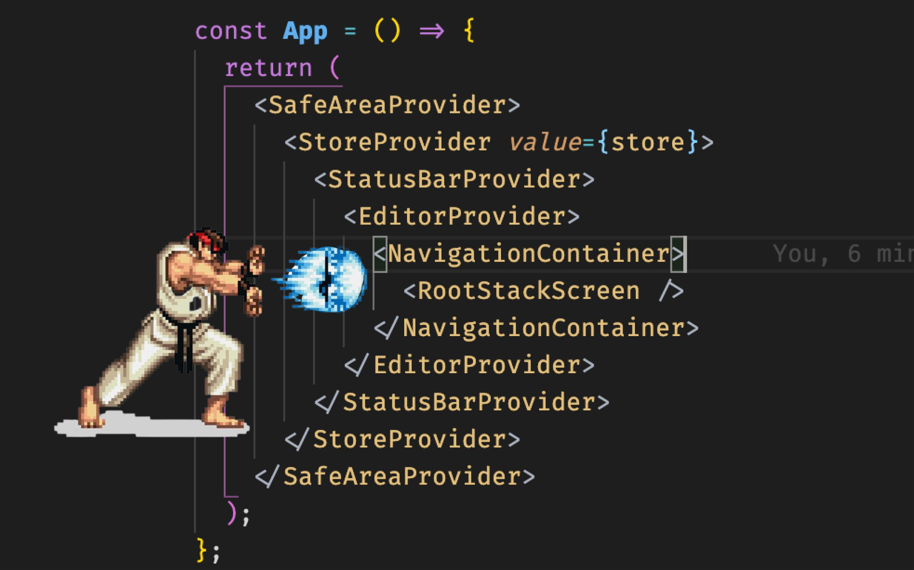
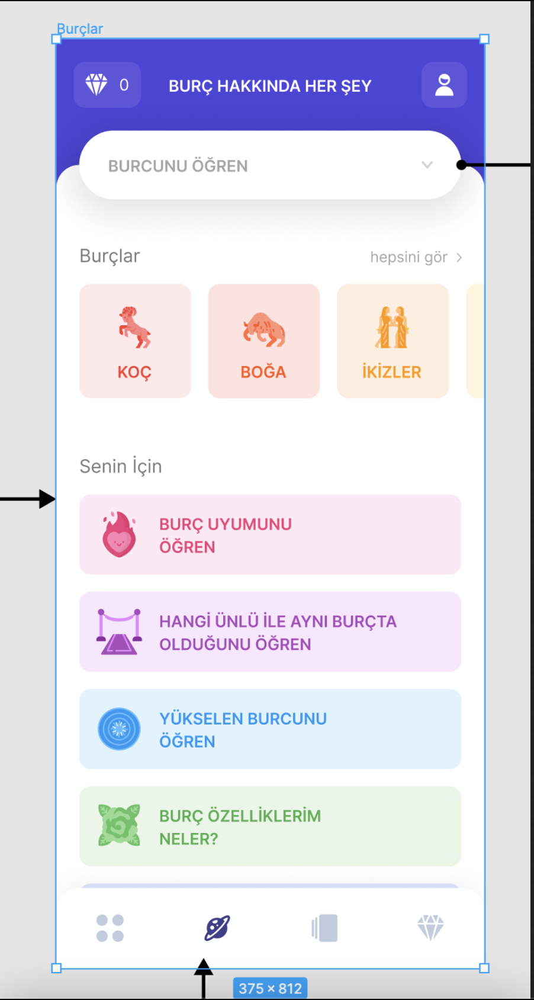

Evet biliyorum _clickbait_ başlık ama son zamanlarda (_7 ay_) React Native
ile baya bi' uygulama geliştirdim. Bu süreçte öğrendiğim bazı şeyleri paylaşmak istiyorum.
Burada anlatacağım her şey belki en doğru yöntem değil fakat React Native projelerimi
bu şekilde oluşturuyorum ve şimdiye kadar sorun yaşamadım.

Bu yazıda gelir getirmesi istenen bir uygulamanın
_uygulama-içi-satın-alma_, _abonelik_, _metadata_, _build aşamaları_, _markete vermeden update etme_ gibi
konuları ele alacağım. Bunun yanında React tarafında
_store yapısı, hookların efektif kullanımı, API dizaynı_ gibi başlıklardan da bahsetmek istiyorum.

## Projeyi Oluşturmak

Bir React Native uygulaması oluşturmanın birden fazla yolu var. Bunlardan biri
[Expo](https://expo.dev/) kullanmak. Expo kullanmak yeni başlayan biri için oldukça kolay bir yol olabilir.
Fakat kişisel olarak ben artık tercih etmiyorum nedenleri ise:

- Uygulamanın boyutunu fazla **büyütmesi** (Bir QR kod okuyucu yapmıştım ve production
  buildi 67mb olmuştu :D. Bunu azaltmanın yolları var tabi ama o toplara girmeyi tercih etmiyorum)
- Bazı native modulleri Expo üzerinden **kullanamamak**.

Bunlar dışında çok da yok aslında ama normal React Native kurulumuyla başlamak bana
daha fazla kontrol sağlıyor. (Expo kullanıp memnun olanlar da var tabi. [Buradan](https://twitter.com/enesozt_/status/1474039877893296140)
okuyabilirsiniz. Anlaşılan Expo'nun yeni sürümleri yukarda bahsettiğim sorunları çözüyor. Yakında yeniden denerim kendisini.)

#### Typescript

Evet bu [zımbırtı](https://www.typescriptlang.org/) olmadan ben artık uygulama _yazmıyorum_. İlerde anlatacağım çoğu şeyde Typescript
yardımını kullandığım için Typescriptin olmaması kabul edilemez. Unutmayın amacımız kurşun geçirmeyen,
sürdürülebilir bir uygulama oluşturmak. Typescript bu konuda baya kolaylik sağlıyor.
bu yüzden React Native uygulamasını Typescript ile kurmanızı tavsiye ederim.

```shell
$ npx react-native init BestAppEver --template react-native-template-typescript
```

Detaylı kurulumu tabii ki React Native'in [kendi sitesinden](https://reactnative.dev/docs/environment-setup)
bulabilirsiniz.

Ayrıca ilerde proje içi tipler için bir `*.d.ts` dosyanızı oluşturmanızı tavsiye ederim.

```ts
declare global {
	type MyType = {
		name: string;
		//...
	};
}
```

Bu dosyayı oluşturduktan sonra import etmeye gerek kalmadan tiplerinizi kullanabileceksiniz. Fazlalık
importların oluşmasını önlemek için güzel bir yöntem.

### Dizin Yapısı

```shell
❯ tree -L 2 src -C --dirsfirst
src
├── api
│   ├── queries
│   └── index.ts
├── assets
│   ├── fonts
│   └── images
├── components
│   ├── icons
│   ├── Button.tsx
│   ├── Card.tsx
│   ├── CheckBox.tsx
│   ├── Page.tsx
│   ├── Text.tsx
│   └── index.ts
├── icons
│   ├── single-man.svg
│   ├── support-human.svg
│   └── video-player-movie.svg
├── lang
│   ├── en.ts
│   ├── index.ts
│   └── tr.ts
├── navigation
│   └── index.tsx
├── store
│   ├── app.slice.ts
│   └── index.ts
├── styles
│   ├── colors.ts
│   ├── fonts.ts
│   ├── helpers.ts
│   ├── index.ts
│   └── spacing.ts
├── typings
│   └── index.d.ts
├── utils
│   ├── hooks
│   ├── constants.ts
│   └── index.ts
├── views
│   ├── Main
│   ├── ScreenOne
│   └── ScreenTwo
└── bootstrap.tsx

32 directories, 92 files
```

Genel olarak böyle bir dizin yapısı kullanıyorum. Kısaca bir özet geceyim, daha sonra daha detaylı inceleyelim.

- `api` burada backend servisi ile haberleşmek için gerekli dosyalar bulunur. `Axios`, `Apollo` gibi kütühanelerin örneklemeleri burada bulunur
- `assets` burada uygulamada kullanılacak resimler ve fontlar gibi static dosyalar bulunur
- `components` burada uygulama bileşenleri bulunur
  > Tercihen ben bu dizin içinde bir de `index.ts` ekleyip tüm componentleri buradan exportluyorum. Bu, komponenti
  > kullanırken daha temiz bir kod sağlıyor
  >
  > ```ts
  > export { default as Page } from './Page';
  > export { default as Text } from './Text';
  > export { default as Card } from './Card';
  > export { default as Button } from './Button';
  > ```
  >
  > kullanırken
  >
  > ```ts
  > import { Button } from '@/components';
  > ```
- `icons` Burada svg tipinde iconlar bulunur.
- `lang` Burada dil objeleri bulunur
- `navigation` Burada sayfaların navigasyondaki yollarını belirleyen tanımlamalar bulunur
- `store` Burada uygulamanın store dosyaları bulunur
- `styles` Burada renkler, fontlar ve margin-padding değerleri bulunur.
- `typings` Burada uygulamamız için tip tanımlamaları bulunur
- `utils` Burada hooklar, yardımcı methodlar ve sabit değelerin olduğu dosyalar bulunur
- `views` Burada uygulamada kullancağımız sayfalar bulunur
- `bootstrap.tsx` Bu dosya uygulamamızın kök komponenti. Genelde burada uygulama açılmadan önce yüklencek
  asenkron işlemler(network requestleri, local databaseden inital verilerin çekilmesi vb.) yapılır. Provider'ları da
  bu dosyaya yazarım ve genelde şuna benzer:



Eğer SplashScreen kullancaksınız bütün asenkron işlemleri yaptıktan sonra Splash ekranını bu component içinde kaldırabilirsiniz.

Örnek olarak:

```tsx
import React, { useEffect } from 'react';
import SplashScreen from 'react-native-splash-screen';

import RootStackScreen from './navigation';

export default function Bootstrap() {
	useEffect(() => {
		setupApp().then(() => SplashScreen.hide());
	}, []);

	return <RootStackScreen />;
}
```

### Iconlar ve SVG

Yaptığım uygulamaların hiçbirinde tasarımı ben yapmadım elimde her zaman bir [Figma](https://www.figma.com) dosyası oldu. Figmada
iconları `.svg` olarak export alabildiğimden kolayca React Native içerisinde kullanbiliyordum.

Bunun için kullandığım araç [SVGR](https://react-svgr.com/). SVGR nin amacı, svg dosyalarını benim için React componentlerine
dönüştürmek.

#### SVGR kurulumu

```shell
$ yarn add @svgr/cli --dev
$ yarn add react-native-svg
```

Gerekli kütüphaneleri kurduktan sonra npm scriptleri yardımıyla icon ekleme işlemini otomatikleştiriyorum

```json
 "scripts": {
     //...
    "svgr": "svgr ./src/icons -d ./src/components/icons --native --no-dimensions --typescript --svgo-config .svgorc.json",
  }
```

Kısaca yaptığı işi açıklamak gerekirse, svgr ye `./src/icon` dizinini okumasını `--native` parametresi ile `react-native-svg`
e uygun işlem yapmasını, `--no-dimesion` ile _width_ ve _height_ değerlerini kaldırmasını, `--typescript` ile Typescript uyumlu
olmasını, `--svgo-config` config dosyasını yolunu ve sonunda oluşturduğu çıktıları `./src/components/icons` dizine
çıkartmasını istediğimizi belirttik. Config dosyasında ise basitçe:

```json:title=./scgorc.json
{ "plugins": [{ "removeViewBox": false }] } // viewboxu kaldırmak için plugin kullandık
```

Şimdi scripti çalıştırdığımızda

```shell
❯ yarn svgr
yarn run v1.22.10
$ svgr ./src/icons -d ./src/components/icons --native --no-dimensions --typescript --svgo-config .svgorc.json
src/icons/diamond.svg -> src/components/icons/Diamond.tsx
src/icons/button-refresh.svg -> src/components/icons/ButtonRefresh.tsx
src/icons/arrow-left.svg -> src/components/icons/ArrowLeft.tsx
src/icons/heart.svg -> src/components/icons/Heart.tsx
src/icons/reload.svg -> src/components/icons/Reload.tsx
src/icons/office-file.svg -> src/components/icons/OfficeFile.tsx
src/icons/support-human.svg -> src/components/icons/SupportHuman.tsx

✨  Done in 0.98s.
```

Daha sonra istediğim iconu herhangi bir yerde kullanmak çok kolay

```tsx
import * as Icons from '@/components/icons/';

<Icons.ArrowLeft height={15} width={15} color="red" />;
```

### Boyutlar, Boşluklar

Elinizde bir tasarım varsa tasarımda elemente gelip width, height değerlerini pixel cinsiden olduğu gibi
React Native'e vermek çok mantıklı değil. Çünkü faklı ekranlarda aynı pixel değeri istediğimiz sonuçları vermeyebilir.
Bunu çözmek için kullandığım yöntem ise şöyle:

Diyelim ki referans alıdğınız bir tasarım var



Görüldüğü üzere tasarımın frame width değeri **375px**. Dolayısıyla ekrana yerlemiş olan elementler de bu genişlik
değeri baz alınarak yapılmış. Biz de tasarımı uygulamaya geçirirken buna benzer bir yöntem kullanacağız.
Bunun için React Native tarafında `PixelRatio` kullanarak ekranın genişliğine göre şöyle bir
_utility_ fonksiyon yazabiliriz

```ts
import { Dimensions, PixelRatio } from 'react-native';

let screenWidth = Dimensions.get('window').width;

// https://www.npmjs.com/package/react-native-responsive-screen
function widthPercentageToDP(widthPercent) {
	// Parse string percentage input and convert it to number.
	const elemWidth = typeof widthPercent === 'number' ? widthPercent : parseFloat(widthPercent);

	// Use PixelRatio.roundToNearestPixel method in order to round the layout
	// size (dp) to the nearest one that correspons to an integer number of pixels.
	return PixelRatio.roundToNearestPixel((screenWidth * elemWidth) / 100);
}

/**
 * @param size size given in the design
 * @returns responsive size of the text
 */
export function responsiveSize(size: number) {
	return widthPercentageToDP((size / 375) * 100);
}
```

Daha sonra bu `responsiveSize` methodunu fontlarda, spacing değerlerinde kullanabilirsiniz.

```ts
import { responsiveSize as rs } from '@/utils';

export const size = {
	h1: rs(30),
	h2: rs(24),
	h3: rs(20),
	medium: rs(16),
	normal: rs(14),
	input: rs(16),
	regular: rs(14),
	small: rs(12),
	mini: rs(8)
};
```

### API dizaynı

Api dizaynı projeden projeye değişebileceği gibi bir REST API ile çalışıyorsanız endpointleri servis dosyaları şeklinde yazmak mantıklı oluyor.

```ts
import Axios from 'axios';

let baseURL = 'https://api.product.com/';
const TOKEN = '<Token_here>';

const client = Axios.create({
	baseURL,
	headers: {
		Accept: 'application/json, text/plain, */*',
		Authorization: `TOKEN ${TOKEN}`
	}
});

export default client;
```

Diyelim ki API servisiniz size databasede olan araçları veriyor

```ts
import HTTPClient from '../HTTPClient';

export type Car = {
	name: string;
	model: string;
};

export async function fetch(limit?: number) {
	const { data } = await HTTPClient.get<Car[]>('cars/');
	return data;
}
```

Bunun gibi bir servis dosyası yazmak, hem düzeni sağlıyor hem de okunabilirliği artırıyor.

#### Side Effects

Bir API isteği yapacağımız zaman _loading_, _error_ gibi durumları da
yakalamamız ve kullanıcıya bildirmemiz gerekir.

Backend servisini basit bir istek yaptığımızı düşünelim. Sayfa açıldığı zaman
verileri çeksin

```tsx
import React, { useEffect, useState } from 'react';
import { View, Text, FlatList } from 'react-native';

import * as CarService from '@/api/services/Cars';

export default function Index() {
  const [loading, setLoading] = useState(false);
  const [error, setError] = useState(null);
  const [data, setData] = useState<CategoryService.Car[]>([]);

  useEffect(() => {
    setLoading(true);
    CarService.fetch()
      .then(cars => {
        setData(cars);
      })
      .catch(e => setError(e))
      .finally(() => setLoading(false));
  }, []);

  return (
    <View>
      {loading && <Text>Loading...</Text>}
      {error && <Text>Error!</Text>}
      {data && <FlatList .... />}
    </View>
  );
}
```

Görüldüğü gibi her sayfada en az 3 tane state değişkeni tanımlamamız gerekiyor. Böyle 10 tane sayfanız oluduğunu düşünürseniz sürkeli
bu şekilde tanımlamalar yapmak işkence olacaktır. Bunu daha efektif bir hale getirebiliriz.

React tarafında backend servisinden veri çekerken [React Query](https://react-query.tanstack.com/) kullanıyorum.
Basit olarak şöyle

```tsx
import React from 'react';
import { View, Text, FlatList } from 'react-native';
import { useQuery } from 'react-query';

import * as CarService from '@/api/services/Cars';

export default function Index() {
  const { isLoading, isError, data } = useQuery('cars', () =>
    CarService.fetch(),
  );

  return (
    <View>
      {isLoading && <Text>Loading...</Text>}
      {isError && <Text>Error!</Text>}
      {data && <FlatList {...} />}
    </View>
  );
}
```

Yazması gerçekten keyifli oluyor tabi. Fakat React Query sadece "kodu kısaltmak" ile kalmıyor.
Caching, Memorizing, Performance Optimization gibi pek çok farklı sorunu çözüyor.

### Store Yapısı

Ben global state için uygulamarımda [Redux](https://redux.js.org/) ve [Redux-Toolkit](https://redux-toolkit.js.org/) kullanıyorum. Reduxdan önce [Mobx](https://mobx.js.org/README.html),
[Mobx-State-Tree](https://mobx-state-tree.js.org/intro/welcome) gibi kütüphaneler de kullandım. Redux o zamanlar bana bir sürü reducer yazdığın,
bir ton _boilerplate_ içeren kod yazmamın gerektiği, kötü bir kütüphane gibi geliyordu. Son zamanlarda
Redux Toolkit ile birlikte Redux yazmak olukça keyifli hale geldi. Redux Toolkit ile
daha az ve anlaşılır kod ile state'i yönetebildiğimi görünce artık projelerimde Redux kullanmaya
başladım.

Store yazarken dikkat ettiğim 2 şey var. Biri store'u typescript ile doğru ayarlamak.

```ts
import { createSlice, PayloadAction } from "@reduxjs/toolkit";

expot type User  = {
  name: string
}

interface IUserState {
  user: User | null;
}

const initialState: IUserState = {
  user: null
};

export const userSlice = createSlice({
  name: "user",
  initialState,
  reducers: {
    setUser: (state, action: PayloadAction<User>) => {
      state.user = action.payload;
    },
  },
});

export const { setUser } = appSlice.actions;
export default userSlice.reducer;
```

```ts
import { combineReducers, configureStore } from '@reduxjs/toolkit';
import UserSlice from './user.slice';

const reducers = combineReducers({
	user: UserSlice
});

const store = configureStore({
	reducer: reducers
});

export default store;
```

Store tipine doğrudan erişmek için `index.d.ts` ye yazmak mantıklı.

```ts
import store from '@/store';

declare global {
	// Oher Types...

	// Store Types
	type RootState = ReturnType<typeof store.getState>;
	type AppDispatch = typeof store.dispatch;
}
```

Ardından React uygulamasına özel store için iki basit hook yazabiliriz.

```ts
import { TypedUseSelectorHook, useDispatch, useSelector } from 'react-redux';

export const useAppDispatch = () => useDispatch<AppDispatch>();
export const useAppSelector: TypedUseSelectorHook<RootState> = useSelector;
```

Diğer dikkat ettiğim şey ise. Redux slice'larına özel hooklar yazmak. Mesela yukardaki `user`
için söyle bir hook yazılabilir.

```tsx
import { useContext } from "react";

import { useAppDispatch, useAppSelector, User } from "./useStore";
import { setUser as setUserReducer } from "@/store/user.slice";

export default function useUser() {
  const dispatch = useAppDispatch();

  const user = useAppSelector((state) => state.user);

  const setUser = (user: User) => {
    dispatch(setUserReducer(user));
  };

  return { user, setUser };
}


...

// Component içinde
function Index(){
  const user = useUser(); // Storedaki user artık burada

  return ...
}

```

Burada ilk kısmı sonlandırıyorum. Buraya kadar hep React, React Native üzerinde durdum. İkinci kısımda (_eğer üşenmeden yazarsam_) build süreçleri, versyonlama,
uygulama içi satın alma ve abonelik gibi konulara gireceğim.
